# Cricket Auction Platform — System Architecture

This document describes how the application is built, how data flows between components, and how each major feature connects end-to-end.

---

## 1. High-level system context

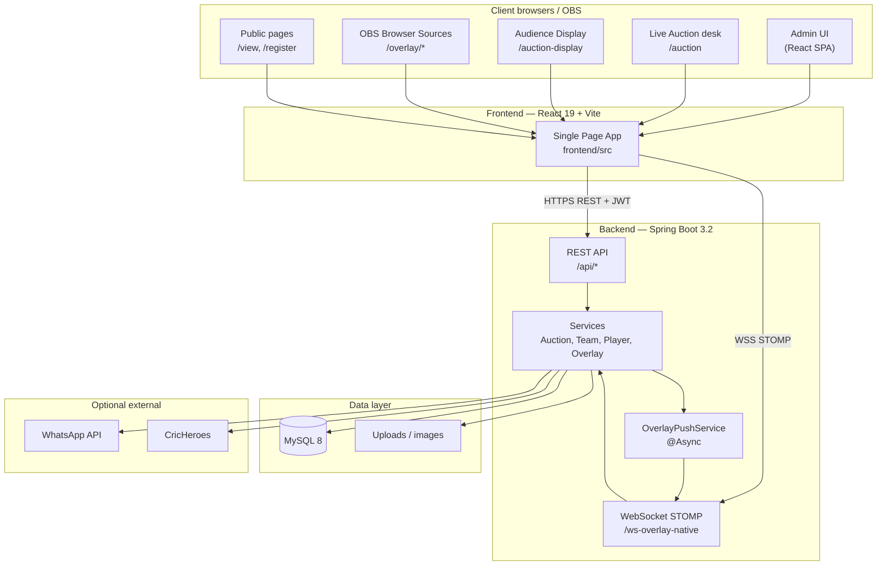

### Deployment (Docker Compose)

| Service | Port | Role |
|---------|------|------|
| `frontend` | 3000 → nginx 80 | Serves built React app |
| `backend` | 8080 | Spring Boot API + WebSocket |
| `mysql` | 3306 | Persistent tournament data |

Production typically adds a reverse proxy (Nginx / Cloudflare) in front with **WebSocket upgrade** enabled for `/ws-overlay-native`.

---

## 2. Application layers

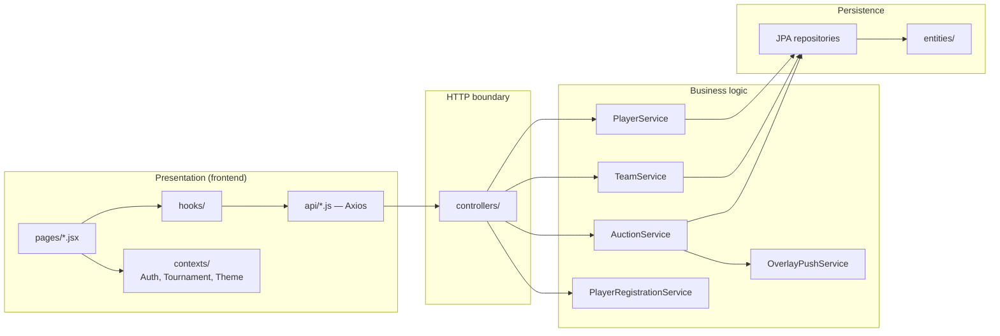

### Key backend services

| Service | Responsibility |
|---------|----------------|
| `AuctionService` | Auction state machine: start, bid, sell, unsold, undo, stop |
| `TeamService` | Teams, budgets, squad rosters |
| `PlayerService` | Player CRUD, Excel import, retained players, CricHeroes |
| `OverlayPushService` | Async WebSocket snapshot push to all overlay subscribers |
| `OverlayController` | Public overlay config + snapshot HTTP API |
| `PlayerRegistrationService` | Public form submissions → import to players |
| `WhatsAppNotifyService` | Optional sold notifications |
| `BidRuleService` | Dynamic bid increment rules per tournament |

### Key frontend modules

| Path | Responsibility |
|------|----------------|
| `pages/AuctionPage.jsx` | Operator auction desk |
| `hooks/useOverlayRealtime.js` | WebSocket + HTTP fallback for all overlays |
| `pages/AuctionDisplayPage.jsx` | Venue LED / audience display |
| `pages/Overlay*.jsx` | OBS broadcast overlays |
| `contexts/AuthContext.jsx` | JWT login, roles |
| `contexts/TournamentContext.jsx` | Active tournament scope |

---

## 3. Security & roles

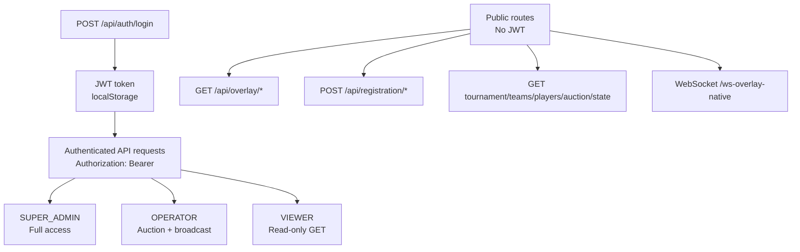

| Role | Frontend routes | Backend write access |
|------|-----------------|----------------------|
| **SUPER_ADMIN** | All + Users, Logs, Form Builder | Tournaments, users, all operator actions |
| **OPERATOR** | Auction, Broadcast, Registrations | Auction, teams, players, broadcast settings |
| **VIEWER** | Home, Players, Teams, Sold, Unsold | Read-only (GET) |
| **Public** | `/view`, `/register`, `/overlay/*`, `/auction-display` | Overlay snapshot GET, registration POST |

JWT is **stateless** — no server session. Each request is authorized via `JwtFilter`.

---

## 4. Tournament data model (conceptual)

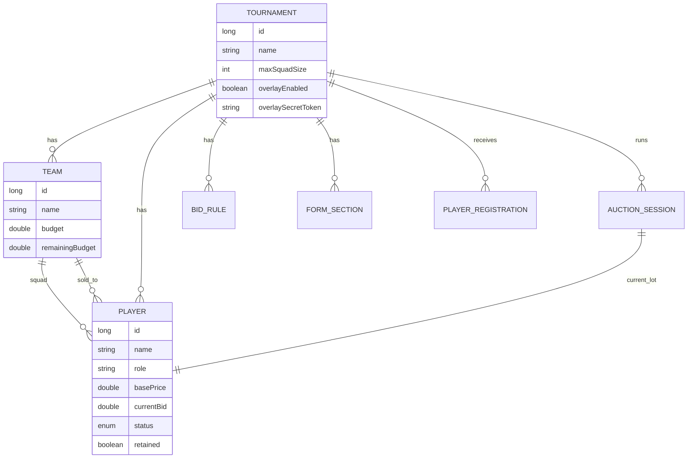

**Player status lifecycle:** `AVAILABLE` → `IN_AUCTION` → `SOLD` | `UNSOLD` (undo can revert)

---

## 5. Authentication flow

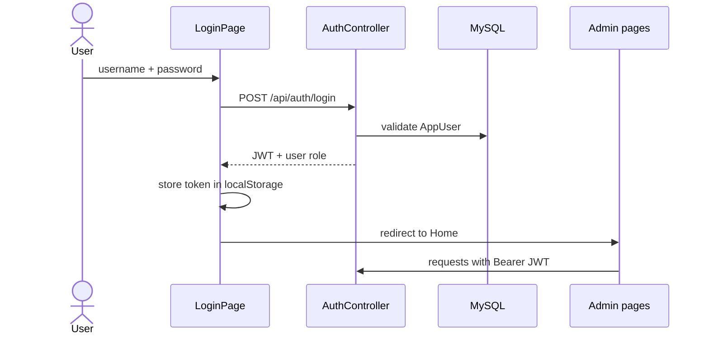

---

## 6. Live auction flow (core)

This is the heart of the system. **Every auction action goes through the REST API on the server.** The server then pushes updates to all overlay clients.

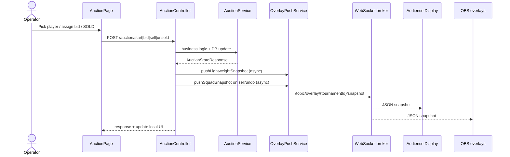

### Auction API endpoints

| Action | Endpoint | Overlay push |
|--------|----------|--------------|
| Start player | `POST .../auction/start/{playerId}` | Lightweight |
| Assign bid | `POST .../auction/bid` | Lightweight |
| Update calling bid | `POST .../auction/calling-bid` | Lightweight |
| **Sell** | `POST .../auction/sell` | Lightweight + **Squad** |
| Unsold | `POST .../auction/unsold` | Lightweight |
| Stop | `POST .../auction/stop` | Lightweight |
| Undo | `POST .../auction/undo` | Lightweight + Squad |

**Lightweight snapshot** = auction state + team summaries (budget, playerCount, no full rosters).  
**Squad snapshot** = full team player lists (for squad overlays / ceremony).

---

## 7. Realtime overlay architecture (critical for multi-PC)

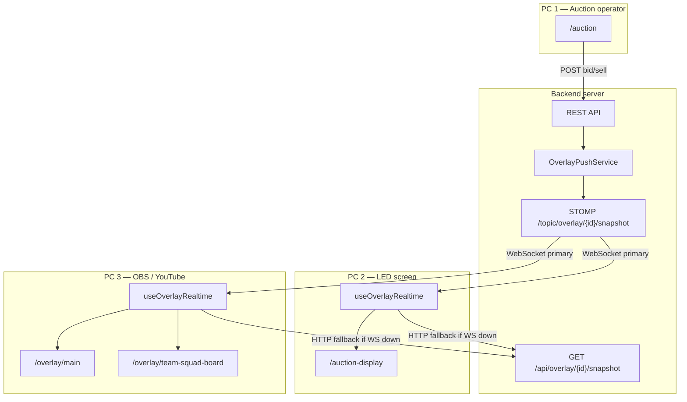

### `useOverlayRealtime` transport strategy

| Mode | When | Latency |
|------|------|---------|
| **WebSocket** | `ws-overlay-native` connected | ~50–300 ms |
| **HTTP poll** | WebSocket failed / stale | ~1.5–3 s |
| **BroadcastChannel** | Same PC only — auction + overlay tabs | Instant (bonus, not relied on for multi-PC) |

### Overlay page map

| Route | Purpose | `includePlayers` |
|-------|---------|------------------|
| `/overlay/main` | Player + bid + team (primary OBS) | No |
| `/overlay/team-budget` | Budget bars | No |
| `/overlay/team-squad` | All teams classic list | Yes |
| `/overlay/team-squad-board` | Rotating premium squad board | Yes |
| `/overlay/ticker` | Scrolling ticker | No |
| `/overlay/sold` / `/unsold` | Verdict full screens | No |
| `/auction-display` | Venue LED + ceremony | Yes (if ceremony on) |
| `/view/{id}` | Public mobile viewer | No (lazy-load tabs) |

---

## 8. Multi-PC event day topology

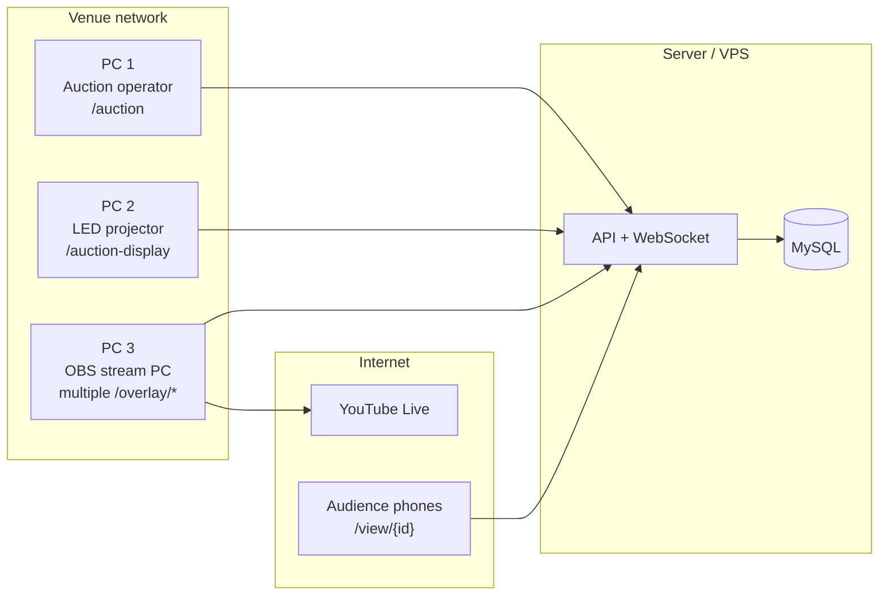

**Important:** PC 1 does **not** push directly to PC 2 or PC 3. All displays subscribe to the **same server feed**. Lag occurs only if WebSocket fails on display PCs (then HTTP polling kicks in).

---

## 9. Player registration flow

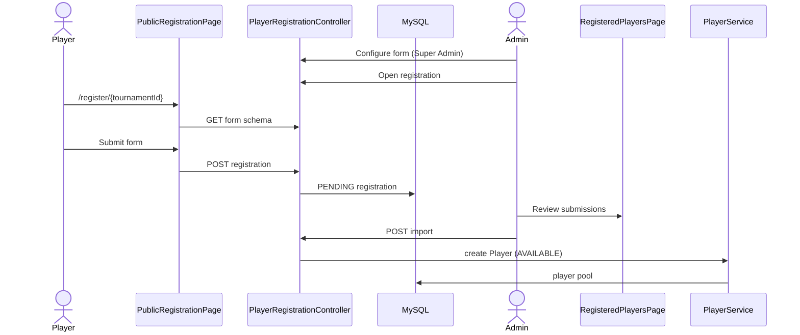

---

## 10. Player import & retained players

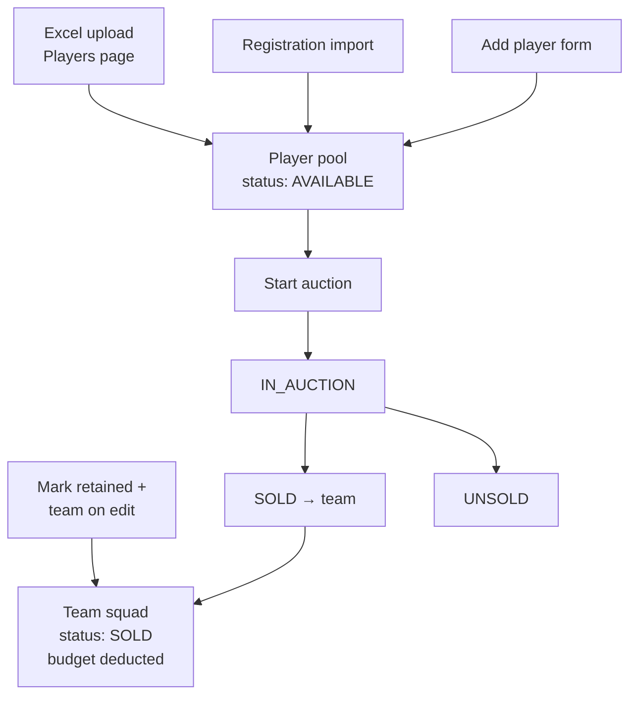

---

## 11. Broadcast control flow

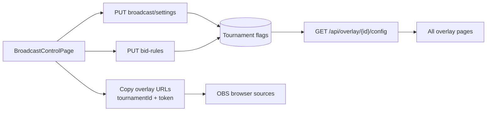

### Tournament broadcast flags (stored in DB)

| Flag | Effect |
|------|--------|
| `overlayEnabled` | Master kill switch for all overlay/display updates |
| `overlayShowSquadFormation` | Audience ceremony after SOLD |
| `overlayShowCinematicIntro` | Cinematic intro on audience display |
| `overlayShowBidPop` | Bid amount pulse animation |
| `maxSquadSize` | Squad board / ceremony capacity |
| `overlaySecretToken` | Optional token on overlay URLs |

---

## 12. WhatsApp notification flow (optional)

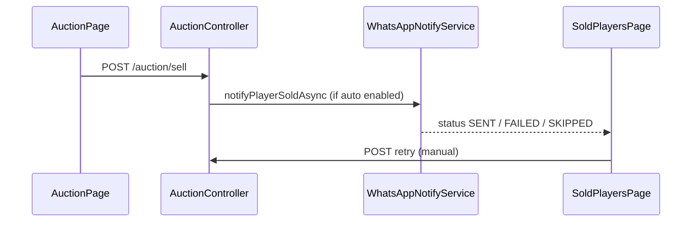

Requires server environment: `WHATSAPP_API_TOKEN`, `WHATSAPP_PHONE_NUMBER_ID`.

---

## 13. Export flows (client-side)

These run **entirely in the browser** — no ongoing server load.

| Export | Page | Mechanism |
|--------|------|-----------|
| Squad Board PDF | Teams | `exportTeamSquadBoard()` → print dialog |
| Classic roster PDF | Teams | `exportTeamRosters()` |
| Squad details CSV+PDF | Teams | `exportTeamSquadDetails()` |
| Player list | Players | `playersExport.js` |
| Registrations Excel | Registrations | xlsx download |

---

## 14. Audience display ceremony flow (SOLD)

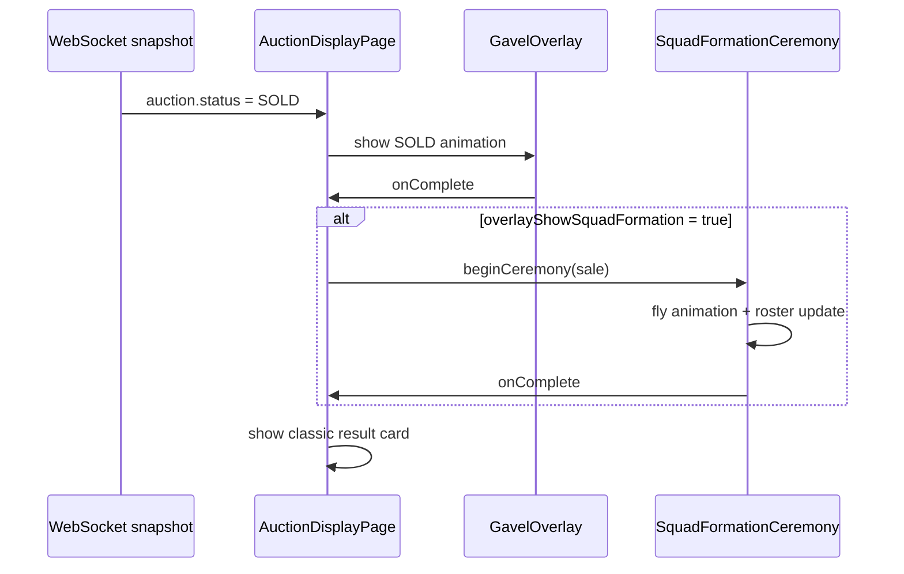

Ceremony uses **local roster state** hydrated from team snapshots + append on sell. Does not slow the auction API.

---

## 15. Caching & performance design

| Area | Strategy |
|------|----------|
| Auction sell | Lightweight WS push first; squad push async |
| Overlay snapshots | Lightweight by default; full players only when needed |
| Audit logs | Async executor (`auditLogExecutor`) |
| Overlay push | Async executor (`overlayPushExecutor`) |
| Admin auction poll | 5 s while ACTIVE (AuctionPage) |
| Overlay HTTP fallback | 1.5 s lightweight poll when WS down |
| DB pool | HikariCP (tuned in application.properties) |

---

## 16. Environment variables (reference)

| Variable | Layer | Purpose |
|----------|-------|---------|
| `VITE_API_URL` | Frontend build | API base URL (also derives WebSocket URL) |
| `DB_USERNAME` / `DB_PASSWORD` | Backend | MySQL credentials |
| `SPRING_DATASOURCE_URL` | Backend | JDBC connection |
| `APP_CORS_ALLOWED_ORIGINS` | Backend | Allowed frontend origins |
| `WHATSAPP_API_TOKEN` | Backend | Optional WhatsApp |
| `WHATSAPP_PHONE_NUMBER_ID` | Backend | Optional WhatsApp |

---

## 17. Request path summary (quick reference)

```
Browser action
    → React page / hook
        → Axios (JWT) or WebSocket (public)
            → Spring Controller
                → Service (business rules)
                    → JPA Repository
                        → MySQL
                    → OverlayPushService (async)
                        → STOMP /topic/overlay/{id}/snapshot
                            → All connected overlay clients
```

---

## 18. Related documents

| Document | Contents |
|----------|----------|
| [`docs/USER_MANUAL.md`](USER_MANUAL.md) | End-user guide, tab by tab |
| [`README.md`](../README.md) | Developer quick start |
| [`AGENTS.md`](../AGENTS.md) | Codebase map for developers |

---

*This architecture reflects the codebase as of 2026. Overlay WebSocket transport improvements are tracked in PR #105 (`cursor/overlay-ws-sync-fix-a561`).*
