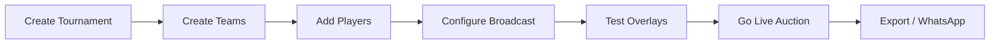
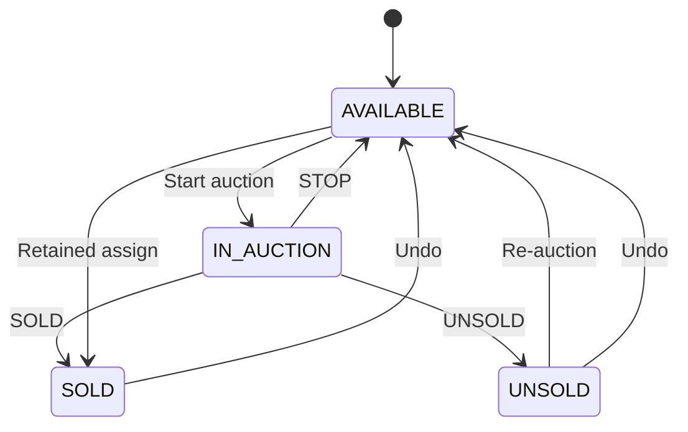

# Cricket Auction Platform — Complete User Manual

**Version:** 1.0  
**Audience:** Tournament organisers, auction operators, broadcast staff, and viewers  
**Last updated:** June 2026

---

## Table of contents

1. [Introduction](#1-introduction)
2. [Getting started](#2-getting-started)
3. [User roles & permissions](#3-user-roles--permissions)
4. [Recommended tournament workflow](#4-recommended-tournament-workflow)
5. [Navigation & global controls](#5-navigation--global-controls)
6. [Home — Tournaments](#6-home--tournaments)
7. [Players](#7-players)
8. [Teams](#8-teams)
9. [Live Auction](#9-live-auction)
10. [Sold players](#10-sold-players)
11. [Unsold players](#11-unsold-players)
12. [Registrations](#12-registrations)
13. [Form Builder (Registration settings)](#13-form-builder-registration-settings)
14. [Broadcast control](#14-broadcast-control)
15. [Overlay & display pages](#15-overlay--display-pages)
16. [Public pages (no login)](#16-public-pages-no-login)
17. [Users & audit logs](#17-users--audit-logs)
18. [Operating from mobile](#18-operating-from-mobile)
19. [Troubleshooting](#19-troubleshooting)
20. [Appendix](#20-appendix)

---

## 1. Introduction

The **Cricket Auction Platform** is a full-stack live auction system for cricket (and football/custom) player drafts. It supports:

- Tournament and squad management  
- Excel player import and public self-registration  
- Real-time live auction with voice, keyboard shortcuts, and undo  
- Broadcast overlays for OBS / projectors / venue screens  
- WhatsApp notifications on player sale (optional)  
- PDF/Excel exports for teams and registrations  

### Who should read which sections?

| Your job | Read these chapters |
|----------|---------------------|
| **Super Admin** (setup everything) | All chapters |
| **Auction operator** (runs live auction) | 2, 3, 4, 5, 7–9, 14–18 |
| **Broadcast / OBS operator** | 5, 14, 15, 16 |
| **Viewer** (watch only) | 2, 3, 5, 16 |
| **Players / public** | 16 only |

> **Screenshot note:** This manual describes every screen in detail. For a **picture edition**, capture screenshots using the shot list in [`docs/screenshots/SHOT_LIST.md`](screenshots/SHOT_LIST.md) and insert them into a PDF copy of this document.

---

## 2. Getting started

### 2.1 Access the application

| Item | Typical value |
|------|----------------|
| **Admin URL** | `https://your-domain.com` (or `http://localhost:3000` locally) |
| **Default login** | Username: `admin` / Password: `admin123` *(change after first login in production)* |
| **API** | Backend at `/api` — configured via `VITE_API_URL` at build time |

### 2.2 First login

1. Open the login page (`/login`).
2. Enter username and password provided by your administrator.
3. Click **Sign In**.
4. You land on **Home (Tournaments)**.

> **Screenshot 2.1:** Login page — username field, password field, Sign In button.

There is **no self-registration** or “forgot password” on the login screen. Contact your Super Admin for access.

### 2.3 Select a tournament

Almost every admin page works on the **currently selected tournament**:

1. Use the **tournament dropdown** in the top navigation bar (right side).
2. Click a tournament card on **Home** to make it active (highlighted border + “Active” badge).

If no tournament is selected, pages show “Select tournament first” or empty states.

### 2.4 Themes

Use the **theme switcher** (top nav) to change appearance:

- Midnight Blue (default)  
- Emerald Night  
- Royal Gold  
- Crimson Fire  
- Ocean Breeze  

Themes are personal (browser) and do not affect overlays or public pages.

---

## 3. User roles & permissions

| Feature | Viewer | Operator | Super Admin |
|---------|:------:|:--------:|:-----------:|
| Home, Players, Teams, Sold, Unsold (view) | ✓ | ✓ | ✓ |
| Live Auction (`/auction`) | — | ✓ | ✓ |
| Registrations | — | ✓ | ✓ |
| Broadcast Control | — | ✓ | ✓ |
| Form Builder | — | — | ✓ |
| Users | — | — | ✓ |
| Audit Logs | — | — | ✓ |
| Create / delete tournament | — | — | ✓ |

### Role descriptions

- **Super Admin** — Full control: tournaments, users, registration form design, audit logs, and everything an Operator can do.
- **Operator** — Runs the live auction, manages registrations import, broadcast settings. May have **custom branding** (logo + app name in navbar).
- **Viewer** — Read-only dashboard for monitoring teams, players, sold/unsold lists. Cannot open the auction desk or broadcast settings.

---

## 4. Recommended tournament workflow

Use this checklist from setup to live day:



### Phase 1 — Setup (days before)

| Step | Where | Action |
|------|-------|--------|
| 1 | Home | Super Admin creates tournament (name, sport, squad size, logo) |
| 2 | Teams | Create all teams with budgets and logos |
| 3 | Form Builder | *(Optional)* Design registration form, open registration |
| 4 | Players | Upload Excel **or** import from Registrations |
| 5 | Players | Mark **retained** players and assign to teams if applicable |
| 6 | Broadcast | Set bid rules, squad size, overlay toggles, copy overlay URLs |
| 7 | Broadcast | Test each overlay URL on the venue PC / OBS |

### Phase 2 — Registration window (optional)

| Step | Where | Action |
|------|-------|--------|
| 1 | Form Builder | Turn **Registration Open** ON |
| 2 | Form Builder | Copy public link `/register/{tournamentId}` and share |
| 3 | Registrations | Review submissions, edit if needed, **Import** to auction pool |

### Phase 3 — Live auction day

| Step | Where | Action |
|------|-------|--------|
| 1 | Broadcast | Confirm **Broadcaster mode enabled** |
| 2 | OBS / venue | Open overlay URLs + Audience Display |
| 3 | Live Auction | Operator runs auction (pick player → bid → assign team → SOLD) |
| 4 | Sold | Monitor WhatsApp delivery (optional) |
| 5 | Teams | Export squad PDFs after auction |

### Phase 4 — After auction

| Step | Where | Action |
|------|-------|--------|
| 1 | Unsold | Re-auction unsold players if doing a second round |
| 2 | Teams | Export Squad Board PDF / Squad Details |
| 3 | Broadcast | Turn **Broadcaster mode** OFF when finished |

---

## 5. Navigation & global controls

### Top navigation bar

| Link | Route | Who sees it |
|------|-------|-------------|
| Home | `/` | Everyone |
| Players | `/players` | Everyone |
| Live Auction | `/auction` | Operator+ |
| Teams | `/teams` | Everyone |
| Sold | `/sold` | Everyone |
| Unsold | `/unsold` | Everyone |
| Registrations | `/registrations` | Operator+ |
| Form Builder | `/registration` | Super Admin |
| Users | `/users` | Super Admin |
| Logs | `/logs` | Super Admin |
| Broadcast | `/broadcast` | Operator+ |

### Right side of navbar

| Control | Purpose |
|---------|---------|
| **User badge** | Shows display name and role |
| **Tournament selector** | Switch active tournament |
| **Theme switcher** | Change UI theme |
| **Logout** | Sign out |

> **Screenshot 5.1:** Full navbar with all links visible (Super Admin account).

---

## 6. Home — Tournaments

**Route:** `/`  
**Purpose:** Create, select, edit, and delete tournaments. View high-level stats.

### Screen sections

1. **Header** — “Tournaments” title + **New Tournament** button (Super Admin only)  
2. **Stats banner** — Total tournaments, teams, players, sold count  
3. **Tournament cards** — One card per tournament  

### Tournament card actions

| Action | How | When to use |
|--------|-----|-------------|
| **Select tournament** | Click the card | Switch all other pages to this tournament |
| **Edit** | Hover → pencil icon (Super Admin) | Change name, display name, sport, roles, squad size, logo |
| **Delete** | Hover → trash icon (Super Admin) | Permanently remove tournament and all data |
| **Share broadcast link** | Hover → share icon | Copies public viewer URL `/view/{id}` |

### Create tournament (Super Admin)

Click **New Tournament** and fill:

| Field | Description |
|-------|-------------|
| Name | Internal tournament name |
| Auction Display Name | Shown on overlays and audience display (e.g. “Royal Trophy Auction Live”) |
| Sport | Cricket / Football / Custom |
| Player Roles | One per line: `KEY\|Label\|Short\|Color` |
| Maximum Squad Size | 5–30 (e.g. 11, 15) — used on squad board and ceremony |
| Description | Optional notes |
| Logo | Optional image |

> **Screenshot 6.1:** Tournament cards grid with one card marked Active.  
> **Screenshot 6.2:** Create / Edit tournament modal with all fields.

### When to use what

- **One tournament per event** — Create separate tournaments for different leagues or seasons.  
- **Squad size** — Set before auction day; affects overlay squad board and audience ceremony.  
- **Auction Display Name** — Use a fan-friendly title; it appears on projectors.

---

## 7. Players

**Route:** `/players`  
**Purpose:** Master player pool — upload, edit, filter, retained players, CricHeroes stats.

### Stats row

| Stat | Meaning |
|------|---------|
| Total | All players in tournament |
| Available | Ready to be auctioned |
| Sold | Purchased by a team |
| Unsold | Went unsold (can re-auction) |
| Retained | Pre-assigned to team before auction |

### Header actions

| Button | When to use |
|--------|-------------|
| **Upload Excel** | Bulk import from spreadsheet |
| **Add Player** | Add one player manually |
| **Export List** | Download current **filtered** list |
| **Fetch All Stats** | Pull CricHeroes stats for all players (slow — run before live day) |
| **Clean Bad Stats URLs** | Remove broken CricHeroes links |
| **Refresh** | Reload player list |

### Filters

| Filter | Options |
|--------|---------|
| Search | Player ID or name |
| Role | All roles or specific (BAT, BOWL, etc.) |
| Status | ALL, AVAILABLE, SOLD, UNSOLD, IN_AUCTION, RETAINED |

### Player card actions

| Action | When to use |
|--------|-------------|
| **Start Auction** | Jump to Live Auction with this player (AVAILABLE only) |
| **Edit** | Change details, image, stats, retained status |
| **Delete** | Remove player permanently |

### Edit player — retained players

Check **Mark as retained player** when a player is already contracted:

1. Select the **team**.  
2. Base price is deducted from that team’s budget immediately.  
3. Player appears on team squad with “Retained” label.

> **When to use retained:** Icon players, franchise keepers, or anyone not going through the live bidding process.

### Excel upload format

**Row 1 = header (skipped).**

| Column | Required | Example |
|--------|----------|---------|
| A — Name | Yes | Virat Kohli |
| B — Role | Yes | BATSMAN, BOWLER, ALL_ROUNDER, WICKET_KEEPER |
| C — Base Price | Yes | 5000 |
| D — Image URL | No | Google Drive or direct image link |
| E+ — Extra columns | No | Stored for squad details export only |

**Google Drive links** are auto-converted. Images may require the viewer to be logged into Google in the same browser.

> **Screenshot 7.1:** Players page with stats cards and filter bar.  
> **Screenshot 7.2:** Upload Excel button and format help box.  
> **Screenshot 7.3:** Edit player modal with retained checkbox and team selector.

---

## 8. Teams

**Route:** `/teams`  
**Purpose:** Create teams, track budgets, view squads, export rosters.

### Budget overview (top)

Shows **total budget**, **spent**, **remaining**, and a progress bar across all teams.

### Team card

| Element | Description |
|---------|-------------|
| Logo + name | Team identity |
| Budget bar | Green → red above 80% spent |
| Player count | Number of squad members |
| **Show/Hide squad** | Expand list of acquired players |

### Actions

| Button | When to use |
|--------|-------------|
| **New Team** | Add a franchise / team before auction |
| **Edit** | Change name, budget, logo |
| **Delete** | Remove team (clears player assignments — confirm first) |
| **Export Squad Board (PDF)** | Premium visual squad board with photos + selling prices — print/save as PDF |
| **Export Classic PDF** | Traditional roster layout |
| **Export Squad Details** | Table PDF + CSV with registration fields (mobile, custom form data) |

### Create team form

| Field | Notes |
|-------|-------|
| Team Name | Required |
| Budget | Required, minimum ₹1,000 |
| Logo | Optional image upload |

> **When to use which export:**
> - **Squad Board PDF** — Presentations, social media, franchise handouts (looks like live overlay board).  
> - **Classic PDF** — Simple printable roster.  
> - **Squad Details** — Organiser records with phone numbers and registration extras.

> **Screenshot 8.1:** Teams page with budget overview and team cards.  
> **Screenshot 8.2:** Expanded squad on a team card.  
> **Screenshot 8.3:** Export buttons in header.

---

## 9. Live Auction

**Route:** `/auction`  
**Purpose:** The main auction desk — only page used to run the live auction.  
**Access:** Operator and Super Admin only. Opens full-width (navbar still visible).

### Layout overview

```
┌─────────────────────────────────────────────────────────┐
│  Toolbar: Voice | Intro | Share | Fullscreen | Keyboard │
├──────────────────────────────┬──────────────────────────┤
│  MAIN STAGE                  │  TEAMS SIDEBAR (desktop) │
│  Player photo + bid controls │  Budget per team         │
│  Team assign grid            │  Highest bidder highlight│
└──────────────────────────────┴──────────────────────────┘
```

### Two modes

#### A) Idle (no active lot)

Shown when no player is on the block.

| Action | When to use |
|--------|-------------|
| Click player card | Start auction for that player |
| **Random Player** | Fair random pick from available pool |
| **Re-auction N Unsold** | When available pool empty but unsold players remain — second round |
| **Undo Last Decision** | Reverse last SOLD or UNSOLD (restores budget) |
| Search box | Find player by ID or name in large lists |

#### B) Active auction (player on block)

**Standard workflow:**

```
1. Adjust calling bid (↑ ↓ or type amount)
2. Assign team (click team or press 1–9)
3. Repeat 1–2 as bidding progresses
4. Press SOLD (or S) when final
   — OR — press UNSOLD (or U)
```

| Button | Shortcut | When to use |
|--------|----------|-------------|
| Bid up | `↑` | Increase calling amount by increment rule |
| Bid down | `↓` | Decrease calling amount |
| Assign team | `1`–`9` or click | Record which team is bidding at current price |
| **SOLD** | `S` | Finalise sale to highest assigned team |
| **UNSOLD** | `U` | Player goes to unsold list |
| **STOP** | — | Abort auction — player returns to **Available** |

> **Important:** Assigning a team records the bidder at the **current displayed price**. It does not auto-increment. Use ↑↓ to change the calling amount between team assignments.

### Toolbar options

| Control | When to use |
|---------|-------------|
| **Keyboard** | Show/hide shortcut cheat sheet |
| **Share broadcast link** | Copy `/view/{tournamentId}` for public mobile viewers |
| **Voice ON/OFF** (`M`) | Browser speaks player name, bids, sold/unsold |
| **Intro ON/OFF** | Toggle cinematic intro on **Audience Display** (if enabled in Broadcast) |
| **Fullscreen** (`F`) | Maximize auction desk on operator screen |

### Teams sidebar

- Shows each team’s **remaining budget** and spend %.  
- **Highest bidder** is highlighted during active auction.  
- Teams with **insufficient budget** for current bid are dimmed/disabled.

### Keyboard shortcuts (full list)

| Key | Action |
|-----|--------|
| `↑` / `↓` | Step bid amount |
| `1`–`9` | Assign to team 1–9 |
| `S` | Sell |
| `U` | Unsold |
| `R` | Random player (idle only) |
| `M` | Toggle voice |
| `F` | Fullscreen |

Shortcuts are **disabled** when typing in an input field (except arrow keys in bid input).

### Undo

**Undo Last Decision** appears when the last action was SOLD or UNSOLD:

- Reverses the sale/unsold  
- Restores team budget  
- Returns player to appropriate state  

Use for operator mistakes — announce undo to the room before clicking.

> **Screenshot 9.1:** Active auction — player photo, bid amount, team grid, SOLD/UNSOLD buttons.  
> **Screenshot 9.2:** Idle stage — available players grid + Random button.  
> **Screenshot 9.3:** Keyboard shortcuts panel.

---

## 10. Sold players

**Route:** `/sold`  
**Purpose:** Post-sale list with WhatsApp notification tracking.

### Summary bar

- Total sold count  
- Mobile numbers found (from registration data)  
- Total amount spent  

### WhatsApp features

| Control | Who | When to use |
|---------|-----|-------------|
| **Auto WhatsApp on sell** | Operator+ | ON = automatic congrats message when player sold. OFF during live auction reduces server load. |
| **Retry WhatsApp (N)** | All | Resend to selected players |
| **Retry all failed** | All | Bulk retry failed messages |

**Requires server configuration** (`WHATSAPP_API_TOKEN`, `WHATSAPP_PHONE_NUMBER_ID`). If not configured, UI shows a warning.

### Table columns

#, Player, Role, Sold Price, Team, Mobile (masked), WhatsApp status

Statuses: **Sent**, **Failed**, **Skipped**, **Sending…**

> **Screenshot 10.1:** Sold players table with WhatsApp status column.

---

## 11. Unsold players

**Route:** `/unsold`  
**Purpose:** View and individually re-auction unsold players.

| Action | When to use |
|--------|-------------|
| **Re-auction** (per card) | Send one player back to live auction |
| Search | Filter by name |

**Bulk re-auction** of all unsold is on the **Live Auction** idle screen (“Re-auction N Unsold”), not here.

> **Screenshot 11.1:** Unsold player cards with Re-auction button.

---

## 12. Registrations

**Route:** `/registrations`  
**Purpose:** Review public sign-ups and import into the auction player pool.  
**Access:** Operator+

### Stats

Total registrations | Pending | Imported

### Actions

| Button | When to use |
|--------|-------------|
| **Export Excel** | Download all registration records |
| **Import All (N) to Auction** | Bulk import pending players at **₹1,000 base** |
| **Import** (row) | Import single pending player |
| **Edit** | Fix name, mobile, photo, custom fields before import |
| **Delete** | Remove registration record |

### Statuses

| Status | Meaning |
|--------|---------|
| PENDING | Awaiting import |
| IMPORTED | Added to Players pool |
| REJECTED | Rejected — cannot import |

After import, edit base price on **Players** page if ₹1,000 default is wrong.

> **Screenshot 12.1:** Registrations table with Import buttons.

---

## 13. Form Builder (Registration settings)

**Route:** `/registration`  
**Purpose:** Configure public registration form and open/close registration.  
**Access:** Super Admin only

### Registration toggle

| State | Effect |
|-------|--------|
| **Open** | Public can submit at `/register/{tournamentId}` |
| **Closed** | Public sees “Registration Closed” |

### General settings

| Field | Purpose |
|-------|---------|
| Banner image | Header on public registration page |
| Success message | Shown after submit |
| WhatsApp / redirect link | e.g. group invite on success page |
| Auto WhatsApp on sell | Same as Sold page setting |

### Form builder

Organise fields into **sections**. Each field has:

| Setting | Description |
|---------|-------------|
| Label | What the player sees |
| Type | Text, Number, Phone, Email, Dropdown, File Upload, Static Image, etc. |
| Required | Must fill to submit |
| Maps to Auction Field | Links to Name, Role, Base Price, or Photo on import |

**Static Image** — Display only (QR codes, instructions). Not submitted.

### Public registration link

Copy from this page when registration is open:

```
https://your-domain.com/register/{tournamentId}
```

> **Screenshot 13.1:** Registration open toggle + public link.  
> **Screenshot 13.2:** Form builder with sections and field types.

---

## 14. Broadcast control

**Route:** `/broadcast`  
**Purpose:** Master control for all overlays, audience display, bid rules, and broadcast URLs.  
**Access:** Operator+

### Broadcaster mode

| Setting | When ON | When OFF |
|---------|---------|----------|
| **Broadcaster mode enabled** | Overlays receive live WebSocket updates | All overlay pages stop updating (auction still works) |

Turn **OFF** during server issues or after event ends.

### Overlay display toggles

| Toggle | Affects | When to enable |
|--------|---------|----------------|
| Show Team Budget | Team budget overlay | Show purse race on stream |
| Show Team List | Classic squad overlay | All teams on one screen |
| Show Ticker | Bottom ticker overlay | Running text on stream |
| Show CricHeroes stats intro | Audience display stats panel | When players have CricHeroes data |
| Stats intro duration | Seconds stats panel stays | 3–8 seconds typical |
| Cinematic player intro | Audience Display only | Big reveal when player picked |
| Main overlay player transition | Main overlay slide animation | Premium main overlay |
| Bid amount pop | All overlays | Pulse on bid change |
| **Audience Squad Formation** | Audience Display only | Full-screen signing ceremony after SOLD |
| Maximum Squad Size | Squad board + ceremony | Match your league rules (5–30) |
| Auto WhatsApp on sell | Sold notifications | Off during auction for speed |
| Enable token | Secures overlay URLs | Use for public streams |

### Bid rule engine

Define **bid increments** by price range:

| Min | Max | Increment |
|-----|-----|-----------|
| 0 | 10000 | 1000 |
| 10001 | 50000 | 2000 |
| 50001 | 999999 | 5000 |

**Rules must be continuous** — no gaps between ranges. Click **Save** after editing rules and settings.

### Overlay URLs (copy for OBS)

Each link includes `tournamentId` and optional `token`:

| Name | Route | Best for |
|------|-------|----------|
| **Main** | `/overlay/main` | Primary stream overlay — player + bid + team |
| **Team Budget** | `/overlay/team-budget` | Budget bars for all teams |
| **Team Squad** | `/overlay/team-squad` | All teams’ squads in grid (classic) |
| **Team Squad Board** | `/overlay/team-squad-board` | One team at a time, premium board, 8s rotate, arrow keys |
| **Audience Display** | `/auction-display` | Venue projector / big screen |
| **Ticker** | `/overlay/ticker` | Scrolling ticker |
| **Sold Screen** | `/overlay/sold` | Full-screen SOLD moment |
| **Unsold Screen** | `/overlay/unsold` | Full-screen UNSOLD moment |
| **Break Screen** | `/overlay/break-screen` | Intermission / break |

**Copy** → paste into OBS Browser Source. **Preview** → test in new tab.

> **Screenshot 14.1:** Broadcast settings checkboxes.  
> **Screenshot 14.2:** Bid rule engine table.  
> **Screenshot 14.3:** Overlay URL list with Copy buttons.

---

## 15. Overlay & display pages

All overlay routes are **public** (no login). Add `?tournamentId=123` and `&token=...` if token is enabled.

### Main overlay (`/overlay/main`)

- Current player photo and name  
- Live bid amount with pop animation  
- Highest bidder team logo  
- SOLD / UNSOLD stamp overlay  
- Player transition when next lot starts  

**Use as:** Primary OBS browser source during auction.

### Team budget overlay (`/overlay/team-budget`)

- All teams with remaining budget bars  

**Use when:** You want a dedicated budget strip on stream.

### Team squad overlay (`/overlay/team-squad`)

- All teams side by side with player lists and prices  

**Use when:** Showing every squad at once (classic layout).

### Team squad board (`/overlay/team-squad-board`)

- **One team at a time** — premium squad board UI  
- Selling prices on cards  
- Auto-rotates every **8 seconds**  
- **← / →** arrow keys or on-screen chevrons to change team  

**Use when:** Clean rotating franchise reveal on stream.

### Audience display (`/auction-display` or `/display-screen`)

Full-screen venue display:

- Large player image  
- Current bid, next increment  
- CricHeroes stats intro (if enabled)  
- Cinematic intro (if enabled)  
- Gavel SOLD / UNSOLD animation  
- Squad formation ceremony after sell (if enabled)  

**Use for:** Projector in the hall — not for small OBS overlays.

Optional URL params:

- `title` — custom header text  
- `sponsor` — sponsor line  
- `token` — if broadcast token enabled  

### Sold / Unsold / Break screens

Full-screen moment graphics triggered by auction state. Add as separate OBS scenes or browser sources.

### Fullscreen button

All overlay pages include a **Fullscreen** button (bottom corner) for clean output in OBS.

> **Screenshot 15.1:** Main overlay during active bid.  
> **Screenshot 15.2:** Audience display with player and bid.  
> **Screenshot 15.3:** Team Squad Board overlay (single team).  
> **Screenshot 15.4:** Squad formation ceremony on audience display.

---

## 16. Public pages (no login)

### Public viewer (`/view/{tournamentId}`)

Mobile-friendly live mirror for audience phones.

| Tab | Content |
|-----|---------|
| Live Auction | Current player, bid, teams |
| Teams | Expandable squads |
| Sold | Sold list |
| Unsold | Unsold list |

**Share** from Live Auction toolbar or Home tournament card.

Disabled when broadcaster mode is OFF.

### Public registration (`/register/{tournamentId}`)

Self-registration form — fields defined in Form Builder.  
Only works when registration is **Open**.

---

## 17. Users & audit logs

### Users (`/users`) — Super Admin

| Action | Purpose |
|--------|---------|
| Create User | Username, password, display name, role |
| Edit | Change role, active status, operator branding |
| Reset Password | Set new password |
| Delete | Revoke access immediately |

**Operator branding:** Custom app name + logo shown in navbar for that operator’s login.

### Audit logs (`/logs`) — Super Admin

Read-only log of admin actions: time, user, action, tournament, details.  
50 entries per page. Search by name or action.

---

## 18. Operating from mobile

You **can** run the live auction from a phone browser (`/auction`). Tips:

| Topic | Guidance |
|-------|----------|
| **Overlays on another device** | Overlays update via **server WebSocket**, not from your phone’s browser. Ensure venue PC has working internet and overlay URLs open. |
| **Same PC as overlays** | Desktop on same machine gets **instant** extra sync; mobile does not. |
| **Keyboard shortcuts** | Limited on mobile — use on-screen buttons. |
| **Team assign** | Tap team buttons (number keys 1–9 may not work on all mobile keyboards). |
| **Fullscreen** | Use mobile browser “Add to Home Screen” for cleaner view. |
| **Share link** | Use Share button to send public viewer URL to audience. |

If overlays lag when using mobile, check WebSocket on the **overlay PC** (see Troubleshooting), not the phone.

---

## 19. Troubleshooting

### Overlays not updating

| Check | Action |
|-------|--------|
| Broadcaster mode | Broadcast → must be **enabled** |
| Correct URL | `tournamentId` matches active tournament |
| Token | If enabled, same token in URL |
| WebSocket | Open overlay with `?debugOverlay=1`, check browser console for `[overlay-sync] accept websocket` |
| Proxy / hosting | Ensure `wss://your-api/ws-overlay-native` is allowed (Nginx/Cloudflare WebSocket upgrade) |
| Mobile operator | Normal — overlays depend on server, not phone browser |

### Player images not showing

- Google Drive images may need login in overlay browser.  
- Use direct image URLs or upload images to the server.  
- Check image URL in player edit modal.

### Excel upload fails

- Use `.xlsx` or `.xls`  
- Column order: Name, Role, Base Price, Image URL  
- Valid roles: BATSMAN, BOWLER, ALL_ROUNDER, WICKET_KEEPER  

### WhatsApp not sending

- Server env vars must be set  
- Player needs mobile in registration data  
- Check Sold page for Failed status → Retry  

### Undo not available

- Only available immediately after SOLD/UNSOLD  
- Disappears after next player is started  

### Voice not working

- Click page once (browser autoplay policy)  
- Toggle Voice ON in auction toolbar  
- Some mobile browsers have limited TTS  

### Bid increment wrong

- Check **Broadcast → Bid Rule Engine**  
- Click **Save** after changes  
- Refresh auction page  

---

## 20. Appendix

### A. Default credentials (change in production)

| Field | Value |
|-------|-------|
| Username | `admin` |
| Password | `admin123` |

Create separate Operator accounts for auction day. Do not share Super Admin password.

### B. URL quick reference

| Page | URL pattern |
|------|-------------|
| Login | `/login` |
| Admin home | `/` |
| Live auction | `/auction` |
| Public viewer | `/view/{tournamentId}` |
| Public registration | `/register/{tournamentId}` |
| Audience display | `/auction-display?tournamentId={id}` |
| Main overlay | `/overlay/main?tournamentId={id}` |
| Squad board overlay | `/overlay/team-squad-board?tournamentId={id}` |

### C. Player roles (cricket default)

| Key | Label | Short |
|-----|-------|-------|
| BATSMAN | Batsman | BAT |
| BOWLER | Bowler | BOWL |
| ALL_ROUNDER | All-Rounder | AR |
| WICKET_KEEPER | Wicket Keeper | WK |

Football tournaments use a different default set (GK, DEF, MID, FWD).

### D. Player status lifecycle



### E. OBS setup (quick)

1. Add **Browser Source** in OBS.  
2. Paste overlay URL from Broadcast page.  
3. Set width **1920**, height **1080** (or your canvas).  
4. Check **“Shutdown source when not visible”** OFF for live overlays.  
5. Add **Audience Display** as separate source or scene for venue feed.  
6. Test SOLD/UNSOLD transitions before going live.

### F. Screenshot edition

To produce a picture manual for your clients:

1. Log in as `admin` / `admin123` (or your operator account).  
2. Follow the shot list in [`docs/screenshots/SHOT_LIST.md`](screenshots/SHOT_LIST.md).  
3. Insert images into Word/Google Docs or export this file to PDF with images.

### G. Support checklist for new deployments

- [ ] Change default admin password  
- [ ] Create Operator account for auction host  
- [ ] Set `VITE_API_URL` to production API  
- [ ] Enable WebSocket on reverse proxy  
- [ ] Configure WhatsApp env vars (optional)  
- [ ] Test all overlay URLs before event  
- [ ] Upload players and create teams  
- [ ] Set squad size and bid rules in Broadcast  

---

*End of user manual. For technical deployment details, see the root `README.md`.*
